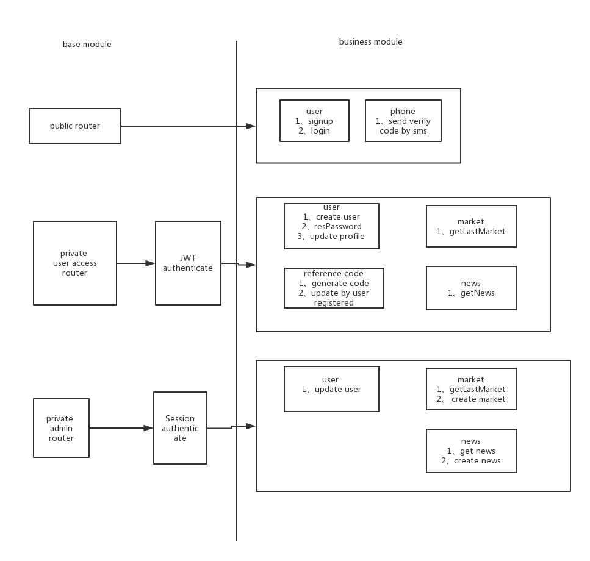

## 简介
  Backend-Service-API-Demo 是一个基于 Nodejs 后端项目，提供比特币零钱包，用户注册，实时查看市场交易信息等功能。

## 项目架构


## 技术架构
- 后端开发框架：eggjs，基于 koa，提供一个强约束又不失灵活的企业级框架。详情参考官网(https://eggjs.org)
- 数据库：mongodb
- 缓存：redis，主用来缓存实时交易咨询数据
- 鉴权：jwt

## 编码规范
- eslint
- eggjs 官网最佳实践指导

## 开发
安装 `npm install`
运行 `npm run dev`


## npm scripts
检查风格 `npm run lint`
单元测试 `npm test`
代码覆盖 `npm run ci`

## docker deploy
```bash
cd docker/prod
docker-compose up -d
```

## TODO:
- [] reference code
- [] 日志监控
